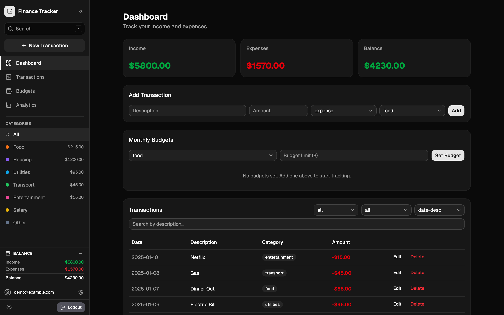
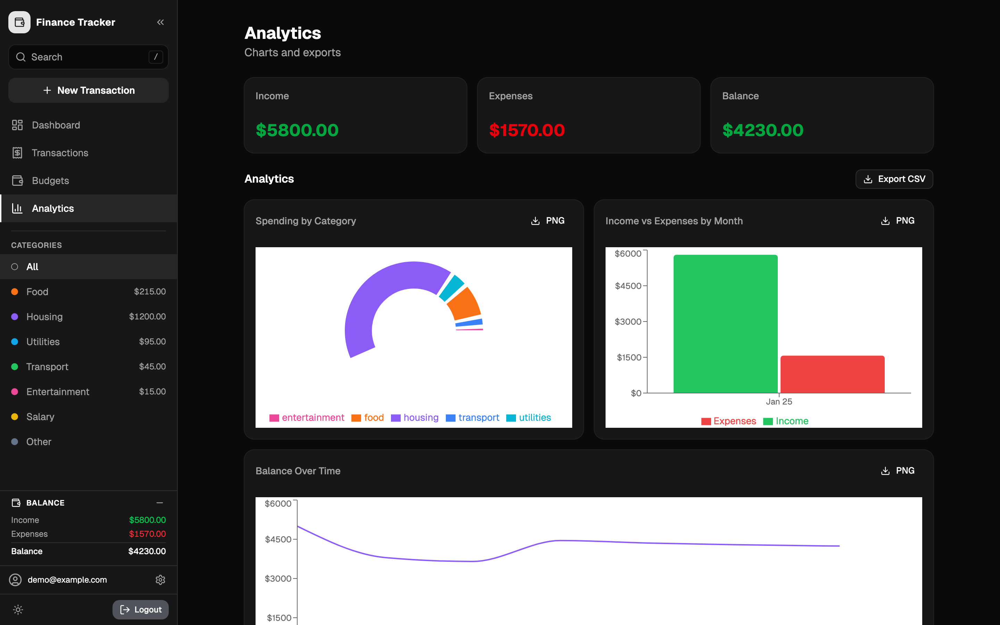
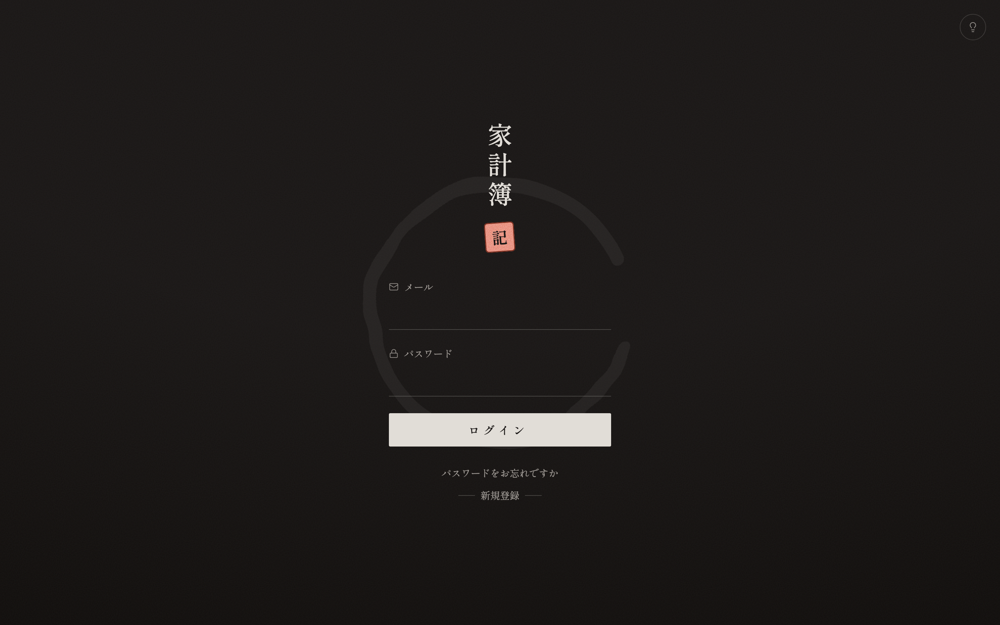

# Expense Tracker

A full-stack personal finance tracker. Track income and expenses, view a live balance summary, filter by category, and manage your data with a secure account.

## Screenshots

**Dashboard** — left navigation rail, summary cards, budgets and the transaction table



**Analytics** — spending by category, income vs expenses, balance over time



**Sign in** — wabi-sabi themed auth screen



## Tech Stack

**Frontend**
- React 19 + Vite 7
- Tailwind CSS v4
- shadcn/ui components
- Recharts (analytics charts)
- lucide-react (icons)
- next-themes (light/dark, defaults to dark)
- Shippori Mincho + Noto Serif JP (self-hosted via fontsource)

**Backend**
- Node.js + Express 5
- PostgreSQL (via Docker)
- Prisma 7 ORM
- JWT authentication + bcrypt

**Testing**
- Playwright (E2E)

## Features

- Register and login with secure JWT authentication
- Forgot password flow with reset token (no email service required — see note below)
- Change password from inside the app while logged in
- Rate limiting on all auth endpoints (20 requests per 15 minutes per IP)
- Add, edit, and delete transactions with confirmation
- Search transactions by description and sort by date or amount
- Client-side validation on all forms with inline error messages
- Live summary of income, expenses, and balance
- Left navigation rail with search (`/`), per-category spend, and a docked balance panel — collapses to an icon rail, becomes a drawer on mobile
- Filter transactions by type and category
- Monthly budget limits with progress bars and over-budget warnings
- Light/dark toggle on every screen, including sign-in; defaults to dark
- Data persists in PostgreSQL database
- Analytics dashboard with spending by category (donut chart), income vs expenses by month (bar chart), and balance over time (line chart)
- Export transactions to CSV and charts to PNG

## Design

The sign-in screen uses a **wabi-sabi (侘寂)** aesthetic built around the *kakeibo* (家計簿) idea — the Japanese art of household bookkeeping:

- Warm washi-paper background with a subtle grain and aged-edge vignette
- Sumi ink (charcoal) type with a single vermilion (朱) accent — no other color
- A hand-drawn ensō brush circle (balance / a coin) behind the form
- Vertical 家計簿 wordmark and a textured 記 hanko seal
- Boxless fields with Japanese labels and brush underlines
- Light and dark (sumi-night) variants, switched with a bulb button in the corner
- Buttons stay Japanese-only; hovering reveals the English word drawn as hand-built angular strokes (not a system font)
- Errors are translated to Japanese so a failed login never breaks into English
- Auth buttons show a loading state while a request is in flight, and the reset-token screen counts down its 15-minute expiry live

All design tokens are scoped to a `.wabi` class in `src/index.css`, so the rest of the app keeps the neutral shadcn theme.

The app behind the login uses that neutral theme with a left navigation rail
modelled on DEX Screener's: brand and collapse toggle, a search box bound to
`/`, a new-transaction action, the four views, a colour-dotted category list
showing spend per category, a docked balance panel, and the account and
theme/logout rows. It collapses to a 64px icon rail (remembered across reloads)
and becomes an off-canvas drawer below the `md` breakpoint. It is built on the
existing `--sidebar-*` tokens, so it follows light and dark automatically.

## Getting Started

### 1. Start the database

Make sure Docker Desktop is running, then:

```bash
docker compose up -d
```

This publishes Postgres on port 5432. If that port is already in use, create a
`docker-compose.override.yml` to publish a different one:

```yaml
services:
  db:
    ports:
      - "5433:5432"
```

### 2. Configure the environment

`.env` is gitignored, so create your own from the template:

```bash
cp .env.example .env
```

It contains `DATABASE_URL` and `JWT_SECRET`. The defaults work as-is for local
development — but if you changed the database port above, update the port in
`DATABASE_URL` to match.

> **If migrations fail with `P1010: User was denied access`**, something other
> than this project's container is answering on that port — most often a
> Postgres installed natively on your machine. Check with
> `lsof -nP -iTCP:5432 -sTCP:LISTEN`. Publish the container on a free port using
> the override above and point `DATABASE_URL` at it.

### 3. Set up the database

```bash
npm install
npm run db:migrate    # Create tables
npm run seed          # Load sample data (optional)
```

Demo account after seeding: `demo@example.com` / `password123`

### 4. Run the app

```bash
npm run dev
```

Opens at `http://localhost:5173` (frontend) with API at `http://localhost:3000`.

## Available Scripts

```bash
npm run dev           # Start frontend + backend together
npm run client        # Frontend only (Vite)
npm run server        # Backend only (Express)
npm run build         # Production build
npm run lint          # Run ESLint
npm run seed          # Seed database with sample data
npm run db:migrate    # Run Prisma migrations
npm run db:generate   # Regenerate Prisma client
npm run db:reset      # Reset database (dev only)
npm test              # Run Playwright E2E tests
npm run test:ui       # Open Playwright UI
```

## Project Structure

```
├── server/
│   ├── index.js              # Express app and all API routes
│   ├── middleware/auth.js    # JWT verification middleware
│   └── routes/auth.js        # Register, login, forgot/reset password endpoints
├── prisma/
│   ├── schema.prisma         # User, Transaction, Budget models
│   ├── seed.js               # Sample data seeder
│   └── migrations/           # Database migrations
├── src/
│   ├── App.jsx               # Root component, auth state, API calls, view/filter state
│   ├── AuthPage.jsx          # Login, register, forgot password, reset password
│   ├── Sidebar.jsx           # Left navigation rail
│   ├── Summary.jsx           # Income / expense / balance cards
│   ├── TransactionForm.jsx   # Add transaction form with validation
│   ├── TransactionList.jsx   # Filterable transaction table with edit and delete
│   ├── BudgetManager.jsx     # Monthly budget limits and progress tracking
│   ├── Analytics.jsx         # Charts dashboard (recharts) + CSV/PNG export
│   ├── lib/categories.js     # Shared category list
│   └── components/ui/        # shadcn/ui components
├── tests/
│   ├── auth.spec.js              # Auth E2E tests
│   ├── transactions.spec.js      # Transaction add/delete/filter E2E tests
│   ├── edit-transaction.spec.js  # Edit transaction E2E tests
│   └── budget.spec.js            # Budget manager E2E tests
├── docs/screenshots/         # Images used by this README
├── .env.example              # Template for your local .env
└── docker-compose.yml        # PostgreSQL container
```

## Password Reset (No Email Required)

Instead of sending a reset link by email, this app shows the reset token directly on screen. This is intentional — it keeps the project simple with zero external services or API keys needed.

Here's how it works:
1. Click **"Forgot password?"** on the login page and enter your email
2. A reset token appears on screen — copy it
3. Paste the token into the reset form along with your new password
4. Done — the token expires in 15 minutes and is deleted after use so it can't be reused

> In a real production app you would email this token to the user instead of showing it on screen.

## API Endpoints

| Method | Endpoint | Auth | Description |
|--------|----------|------|-------------|
| POST | `/api/auth/register` | No | Create account |
| POST | `/api/auth/login` | No | Login, returns JWT |
| POST | `/api/auth/forgot-password` | No | Generate a password reset token |
| POST | `/api/auth/reset-password` | No | Reset password using token |
| POST | `/api/auth/change-password` | Yes | Change password while logged in |
| GET | `/api/transactions` | Yes | Get user's transactions |
| POST | `/api/transactions` | Yes | Add transaction |
| PATCH | `/api/transactions/:id` | Yes | Edit transaction |
| DELETE | `/api/transactions/:id` | Yes | Delete transaction |
| GET | `/api/budgets` | Yes | Get user's budgets |
| POST | `/api/budgets` | Yes | Create or update a budget |
| DELETE | `/api/budgets/:id` | Yes | Delete a budget |

## Testing

```bash
npm test          # Run the Playwright E2E suite
npm run test:ui   # Open the Playwright UI
```

Playwright starts its own frontend and backend, so **stop `npm run dev` before
running the tests**. Its config sets `reuseExistingServer: true`, which means an
already-running dev server gets reused — and that server is not started with
`NODE_ENV=test`. Without that flag the auth rate limit is 20 requests per 15
minutes instead of 1000, so the suite runs out partway through and several tests
fail with confusing "element not found" errors rather than an obvious 429.
